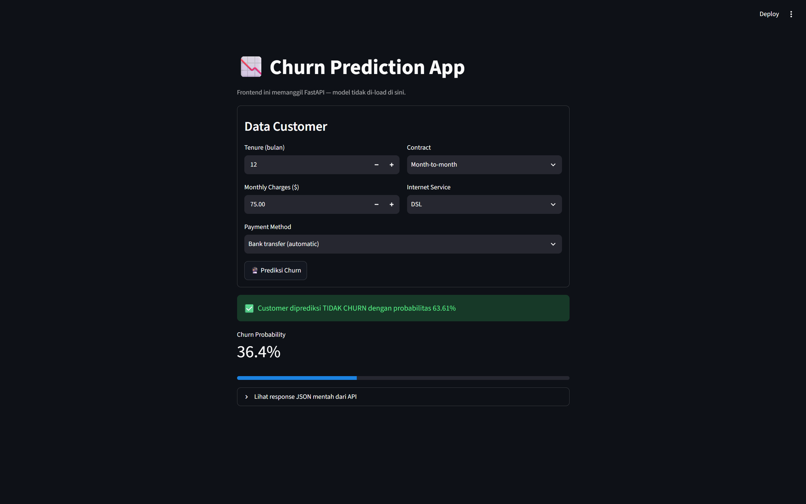
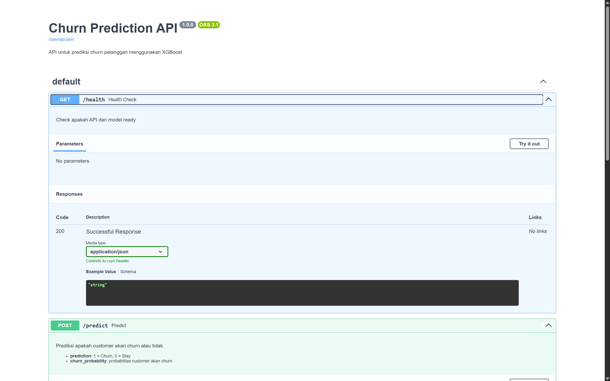

# 📉 Customer Churn Prediction — End-to-End ML Project

End-to-end machine learning portfolio project: dari data mentah Kaggle → training model → **API prediksi (FastAPI)** → **web app (Streamlit)**.


## 🎯 Problem

Churn (pelanggan berhenti berlangganan) adalah biaya silencet tapi besar bagi bisnis subscription/telekomunikasi.
**Goal:** memprediksi customer mana yang berisiko churn agar tim bisnis bisa melakukan aksi retention lebih awal.

## ⚡ Demo

**Streamlit Web UI** (`:8501`) — form input → prediksi real-time dari API:



**FastAPI Interactive Docs** (`:8000/docs`) — Swagger UI otomatis:



## 🏗️ Architecture

```
┌──────────────┐    ┌───────────────────┐    ┌────────────────────┐
│ data/raw     │───>│ src/data_prep.py  │───>│ data/processed     │
└──────────────┘    └───────────────────┘    └─────────┬──────────┘
                                                       ▼
                                           ┌────────────────────┐
                                           │ src/train_model.py │
                                           │ OneHot + XGBoost   │
                                           └─────────┬──────────┘
                                                     ▼
                             ┌──────────────────────────────────────┐
                             │ api/model.pkl + api/model_meta.json  │
                             └──────────────────┬───────────────────┘
                                                ▼
┌────────────────┐   HTTP POST    ┌─────────────────────────────┐
│ Streamlit UI   │───────────────>│ FastAPI (app.py) :8000      │
│ :8501          │<───────────────│ load model.pkl, predict     │
└────────────────┘   JSON result  └─────────────────────────────┘
```

Frontend dan backend **terpisah penuh** — UI tidak me-load model, hanya memanggil API lewat HTTP (pola arsitektur industry-standard).

## 📁 Project Structure

```
churn-ml-project/
├── api/
│   ├── model.pkl            # trained model (lokal, gitignored — regenerate via training)
│   └── model_meta.json      # model card: features, class counts, scale_pos_weight
├── data/
│   ├── raw/                 # dataset mentah dari Kaggle
│   └── processed/           # hasil cleaning (gitignored, bisa digenerate ulang)
├── docs/                    # screenshot untuk README
├── src/
│   ├── data_prep.py         # pipeline cleaning & preprocessing
│   └── train_model.py       # training XGBoost + simpan model & metadata
├── ui/
│   └── app.py               # frontend Streamlit
├── app.py                   # backend FastAPI
├── requirements.txt
└── README.md
```

## 🚀 Quick Start

```bash
# 1. Clone repo
git clone https://github.com/fkennyp/churn-ml-project.git
cd churn-ml-project

# 2. Install dependencies
pip install -r requirements.txt

# 3. Prepare data & train model (menghasilkan model.pkl)
python src/data_prep.py
python src/train_model.py

# 4. Jalankan API backend (terminal 1)
python -m uvicorn app:app --reload --port 8000

# 5. Jalankan frontend (terminal 2)
python -m streamlit run ui/app.py
```

Buka **http://localhost:8501** → isi form → dapatkan prediksi churn beserta probabilitasnya.

## 🔌 API Endpoints

| Method | Endpoint  | Fungsi                                  |
|--------|-----------|-----------------------------------------|
| GET    | `/health` | Health check (model loaded?)            |
| POST   | `/predict`| Prediksi churn dari data customer       |

Contoh request `POST /predict`:

```json
{
  "tenure": 2,
  "MonthlyCharges": 85.5,
  "Contract": "Month-to-month",
  "InternetService": "Fiber optic",
  "PaymentMethod": "Electronic check"
}
```

Contoh response:

```json
{
  "prediction": 1,
  "churn_probability": 0.8738,
  "message": "⚠️ Customer diprediksi CHURN dengan probabilitas 87.38%"
}
```

Interactive docs (Swagger): `http://localhost:8000/docs`

## 📊 Data & Model

- **Dataset:** Customer Churn (Kaggle), ±7.043 customer
- **Features:**
  - Numeric: `tenure`, `MonthlyCharges`
  - Categorical: `Contract`, `InternetService`, `PaymentMethod` (OneHotEncoder)
- **Class imbalance:** 1.495 churn vs 4.139 non-churn pada data training → ditangani dengan `scale_pos_weight ≈ 2.77` pada XGBoost
- **Model:** `XGBClassifier` dalam scikit-learn `Pipeline` (preprocessing + classifier dalam satu objek)
- **Model metadata:** lihat [`api/model_meta.json`](api/model_meta.json)

**Performance pada data test:**

| Metric         | Value      |
|----------------|------------|
| Accuracy       | [ISI_DARI_OUTPUT_TRAINING] |
| ROC-AUC        | [ISI_DARI_OUTPUT_TRAINING] |
| Recall (churn) | [ISI_DARI_OUTPUT_TRAINING] |

## 🧠 Lessons Learned

- Menangani **class imbalance** dengan `scale_pos_weight`, bukan akurasi mentah
- Membungkus preprocessing + model dalam satu **Pipeline** agar tidak bocor saat inference
- Memisahkan **frontend & backend** lewat HTTP API, bukan satu script monolit
- **Pydantic** untuk validasi input di tepi API — data ngawur ditolak otomatis (HTTP 422)
- Menyimpan **model metadata** agar eksperimen reproducible dan terdokumentasi

## 🗺️ Roadmap

- [ ] Containerization dengan Docker
- [ ] Deploy API ke cloud (Render / Railway)
- [ ] Monitoring drift model
- [ ] CI/CD dengan GitHub Actions

## 📬 Contact

**Kenny Putrajaya** — [github.com/fkennyp](https://github.com/fkennyp)